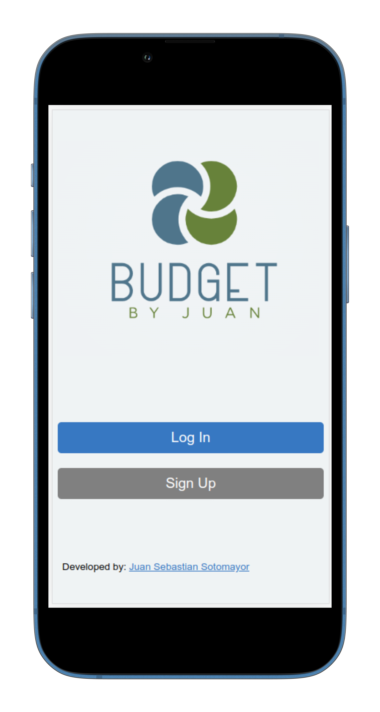
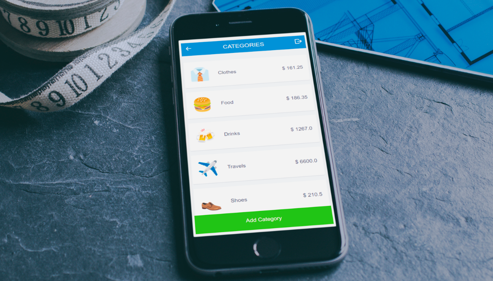

# Budget App

## Description

This app is about building a mobile web application where you can manage your budget: you have a list of transactions associated with a category, so that you can see how much money you spent and on what.

## Built With

- Ruby
- Ruby on Rails
- Heroku
- HTML/CSS

## Live Demo

- Here you can see the live demo (Mobile Version Only) => [LINK](https://budget-app-juanse7793.herokuapp.com/)

## Run it

Use the following steps to run this Project locally:

- Create a directory

- Open the terminal

- Run this command:
`git clone git@github.com:Juanse7793/Recipe-app.git`

- Enter in to the folder:
`cd Recipe-app`

- Open the folder with a code editor (VS Code preferred)

## Author

👤 **Juan Sebastian Sotomayor**

- GitHub: [@Juanse7793](https://github.com/Juanse7793)
- Twitter: [@Juanse77930](https://twitter.com/Juanse77930)
- LinkedIn: [Juan Sebastian Sotomayor](https://linkedin.com/in/juansebastiansotomayor)

## 🤝 Contributing

Contributions, issues, and feature requests are welcome!

Feel free to check the [issues page](../../issues/).

## Show your support

Give a ⭐️ if you like this project!

## Acknowledgments
- Original design idea by [Gregoire Vella on Behance](https://www.behance.net/gregoirevella).
- Hat tip to anyone whose code was used
- Inspiration

## Video

- [Link to the video](https://drive.google.com/file/d/1xlvG1vAnbATt01U7_DRdkd0kZZvVFN1d/view?usp=sharing)

## 📝 License

This project is [MIT](./LICENSE) licensed.